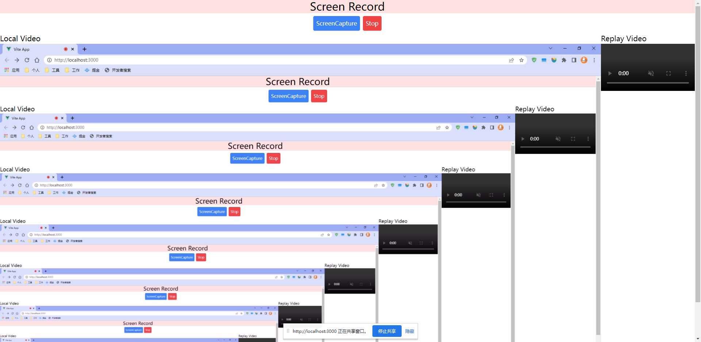
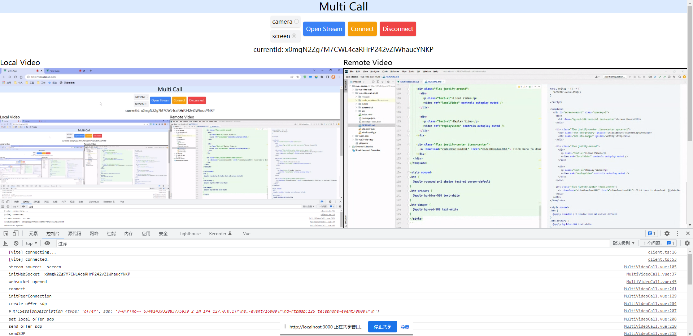
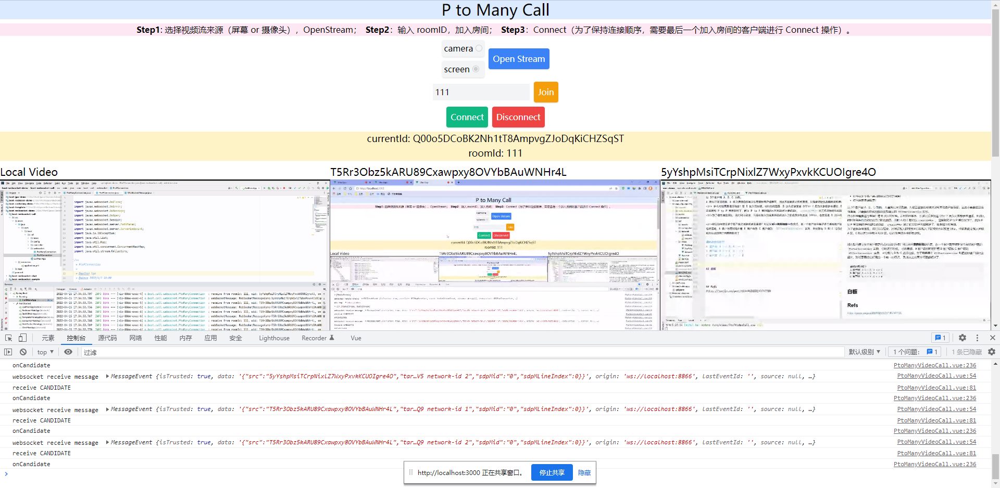

# vue-vite-call-multi

**依赖**
* Vite
* Vue.js
* Windi CSS

<br>

**实现功能**
* 屏幕录制，主要依靠 [getDisplayMedia()](https://developer.mozilla.org/zh-CN/docs/Web/API/MediaDevices/getDisplayMedia) 和 [MediaRecorder](https://developer.mozilla.org/zh-CN/docs/Web/API/MediaRecorder/MediaRecorder) 这两个 API。支持回放和下载
* 白板
* 多人视频

## 屏幕录制
```vue
<script setup>
import { ref } from "vue";

let localVideo = ref(null)

let replayVideo = ref(null)
// 录制视频，进行重放或者保存本地操作
let recorder = ref(null)
let chunks = ref([])
let videoDownloadURL = ref('')

const initVideoSrc = async () => {
  // https://developer.mozilla.org/zh-CN/docs/Web/API/MediaDevices/getDisplayMedia
  const localStream = await navigator.mediaDevices.getDisplayMedia({
    audio: false,
    video: {
      width: 1920,
      height: 1080,
    },
  }).then(stream => {

    const options = {
      /**
       * videoBitsPerSecond: 视频比特率，默认 2.5 Mbps => 2500000
       * 360p => 1 Mbps
       * 480p => 2.5 Mbps
       * 720p => 5 Mbps
       * 1080p => 8 Mbps
       * 1440p => 16 Mbps
       * 2160p => 35 ~ 45 Mbps
       */
      videoBitsPerSecond : 8000000,
      mimeType : 'video/webm'
    }

    // https://developer.mozilla.org/zh-CN/docs/Web/API/MediaRecorder
    recorder.value = new MediaRecorder(stream, options)
    console.log(recorder.value)
    recorder.value.ondataavailable = onRecordData
    recorder.value.onstop = onRecordStop

    return stream
  }).catch(err => {
    console.log('error: ', err.message)
  })

  localVideo.value.srcObject = localStream
  // 本地视频流接入的同时开始录制。除了开始和停止，还有暂停和继续方法，此处未实现
  recorder.value.start()
}

const onRecordData = (evt) => {
  chunks.value.push(evt.data)

  // 为了避免单次视频录制的 size 过大，可以在此方法监控 chunks 的大小，分段进行保存
  if(true /* 判断大小 */) {
    // save to local and clear chunks for next operation
  }
}

/**
 * About URL.createObjectURL, check this link for more: https://developer.mozilla.org/zh-CN/docs/Web/API/File/Using_files_from_web_applications#%E4%BD%BF%E7%94%A8%E5%AF%B9%E8%B1%A1_url
 */
const onRecordStop = (evt) => {
  let blob = new Blob(chunks.value, {type: 'video/webm'})
  let videoURL = URL.createObjectURL(blob)

  // download
  videoDownloadURL.value = videoURL
  
  // replay
  replayVideo.value.onloadeddata = onReplayLoadedData
  replayVideo.value.src = videoURL
  // console.log(replayVideo)

  chunks.value = []
}

const onReplayLoadedData = (objectURL) => {
  // 视频加载完成后释放对象 URL
  console.log('onReplayLoadedData ', objectURL)
  URL.revokeObjectURL(objectURL)
}

const onStop = () => {
  recorder.value.stop()
}

</script>

<template>
  <div id="screen-record" class="space-y-2">
    <div>
      <h1 class="bg-red-100 text-3xl text-center">Screen Record</h1>
    </div>

    <div class="flex justify-center items-center space-x-2">
      <div class="btn btn-primary" @click="initVideoSrc">ScreenCapture</div>
      <div class="btn btn-danger" @click="onStop">Stop</div>
    </div>

    <div class="flex justify-around">
      <div>
        <p class="text-xl">Local Video</p>
        <video ref="localVideo" controls autoplay muted />
      </div>

      <div>
        <p class="text-xl">Replay Video</p>
        <video ref="replayVideo" controls autoplay muted />
      </div>
    </div>

    <div class="flex justify-center items-center">
      <a :download="videoDownloadURL" :href="videoDownloadURL"> Click here to download: {{videoDownloadURL.substring(videoDownloadURL.lastIndexOf('/') + 1) + '.webm'}}</a>
    </div>
  </div>
</template>

<style scoped>
.btn {
  @apply rounded p-2 shadow text-md cursor-default
}
.btn-primary {
  @apply bg-blue-500 text-white
}
.btn-danger {
  @apply bg-red-500 text-white
}
</style>
```



## P to P


## P to Many
> 与 P to P 稍有不同，需要维护多个 RTCPeerConnection

**问题**
* 如何在多个客户端之间建立点对点链接？
* 如何确定连接顺序？

以 3 个客户端 A、B、C 为例。
A 最先打开浏览器，A 建立连接的时候并没有其他客户端存在，因此不需要建立任何连接，只需要初始化视频画面和自己的`RTCPeerConnection`即可。

什么时候需要进行连接？等 B 加入的时候。此时的问题是，B 加入后谁发送 Offer ？因为大家都参与通话，B 加入的时候首先也会初始化自己的视频流，此时 A 和 B 都可以`createOffer`。
这里就和 P to P 有所区别了，因为 P to P 有明确的*呼叫端*和*接收端*，`createOffer`的工作交给呼叫端就好了，接收端不用考虑。

为了避免连接混乱，我们可以规定，只用后加入的成员向已经加入了的成员分别发送 Offer。也就是说 B 加入时给 A 发，C 加入时分别给 A 和 B 发。以此来保证连接的有序性。

那么如何建立多个客户端之间点对点的连接？可以采用**两两相接**的方式，在一个客户端中维护多个其他客户端的`RTCPeerConnection`实例，分别进行连接。
也就是说，A 客户端同时维护着 B 客户端和 C 客户端的 `RTCPeerConnection` 实例，来分别与 B 和 C 进行连接。为了确保每个`RTCPeerConnection`和相应的客户端对应起来，我们需要给它们确定一个唯一的标识。
到此以上的两个问题都解决了
```
最终的情况如下：
A 客户端：A <-> B、A <-> C
B 客户端：B <-> A、B <-> C
C 客户端：C <-> A、C <-> B
```

**其他情况**

P to Many 中也分为两种情况，一种是会议、一种是群聊。会议式可以使用如上述所说，后一个入会者发送 offer 即可。群聊是一个群组中的某一个客户端向其他客户端发送 offer，与其他客户端进行通话。比如说：A、B、C、D，由 A 发起 offer，B、C、D 都收到来自 A 的 offer，并与 A 建立连接。
此时存在的问题是 B、C、D 之间如何两两建立连接？连接顺序如何确定？

类似会议，群聊的流程可以看成客户端 A 创建了一个房间，将其他群员依次拉入房间内，根据组员进群的顺序依次向房间内已存在的客户端发送 offer 建立连接即可。



## 白板
**实现思路**

主要利用
[createDataChannel](https://developer.mozilla.org/zh-CN/docs/Web/API/RTCPeerConnection/createDataChannel#rtcdatachannelinit_dictionary)
这个方法来进行数据传输。主要就是将对 Canvas 的操作封装成数据流传输到远程客户端，远程客户端收到消息，拿着传输过来的数据执行指定的方法即可。

```js
// 创建
let channel = RTCPeerConnection.createDataChannel('messageChannel');
// messageChannel 可以看成是当前 DataChannel 的 id，不得超过 65535 字节

// 接收
RTCPeerConnection.ondatachannel = (event) => {
  let channel = event.channel;
}
```

需要注意的是，`RTCDataChannel`需要由 `createOffer` 的客户端进行创建，并且创建时机需要在 `createOffer` 之前。
其他客户端只需要监听`ondatachannel`即可获取到创建好的`RTCDataChannel`通道并初始化即可使用。`RTCDataChannel`的使用起来比较简单，方法和`websocket`相似。

```js
channel.onopen = evt => {
  console.log('dataChannel opened ! ', evt)
}

channel.onmessage = evt => {
  console.log('dataChannel receive message: ', evt)
}

channel.send('some data here')
```

因为我们不需要视频通话，所以不需要获取本地媒体流。 可以直接把 Canvas 画板作为媒体流来建立连接，白板操作会实时展示在演示画面中。
此时需要使用到一个 API：`captureStream`，就可以把 Canvas 变成媒体流

## Refs
https://developer.mozilla.org/zh-CN/docs/Web/API/WebRTC_API/Protocols
https://juejin.cn/post/6844903830140747789
https://juejin.cn/post/6844903811409149965