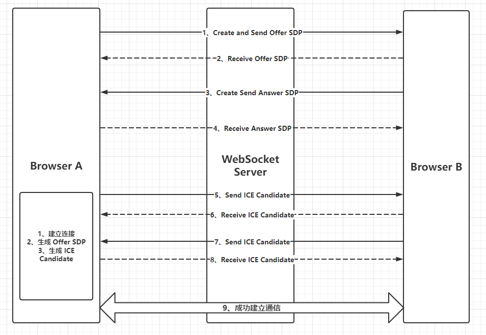

# vue-vite-call

## 前言
  1、What is WebRTC
  2、什么是信令服务器

**WebRTC**
> WebRTC 是网页实时通信（Web Real-Time Communication）的缩写，是一个支持网页浏览器进行实时语音对话或视频对话的技术。

**信令服务器**
> 作为通信数据传输的的中转站，WebRTC 的 SDP 和 ICE 信息需要依赖信令服务器进行消息传输与交换、建立 P2P 连接，之后才能进行音视频通话、传输文本信息。如果没有信令服务器，WebRTC 无法进行通信

## WebRTC 通信实现
> WebRTC 通信是指将实时取得的视频、音频等数据流（字节流）在浏览器之间进行传输以进行通信，即 RTCPeerConnection

`RTCPeerConnection` 具有两个特征
* P2P 通信：在交换过信令并建立连接之后，浏览器与浏览器之间直接进行通信
* 使用 UDP/IP：不像 TCP/IP 能保证数据能准确到达，但是网络负荷较小。与数据可靠性相比，更注重实时性。UDP 端口号可以动态分配，范围在49152~65535之间

### 建立 P2P 通信
> 为了在浏览器与浏览器之间进行通信，首先必须要知道对方的 IP 地址以及动态分配的 UDP 端口号，因此在建立 P2P 连接之前，需要使用 WebRTC 交换一些信息

1、**SDP**
  SDP（Session Description Protocol），会话描述协议，它以字符串的形式保存一些浏览器信息：
* 在浏览器与浏览器之间进行会话所使用的媒体种类（音频/视频），媒体格式（codec）
* 通信双方的 IP 地址和端口号
* P2P 数据传输的协议（在 WebRTC 中为 Secure RTP）
* 通信时所使用的带宽
* 会话的属性（名称、标识符、激活时间）等

2、**ICE**
  ICE（Interactive Connectivity Establishment），交互式连接建立，是一种以 UDP 为基础的，请求/回答模式的多媒体会话，用以实现 [NAT](###NAT) 穿越的协议。
它将 P2P 通信时可以使用的通信途径按照优先级排列出来
* 使用 P2P 直接进行通信
* 集成了多种 NAT 穿越技术，比如 STUN、TURN，可以实现 NAT 穿透
* 使用 STUN（为了穿越 NAT 而进行端口映射）实现突破 NAT 网关的 P2P 通信
* 使用 TURN 中继服务器进行突破防火墙的中继通信

> WebRTC 通过 ICE 协议确定通信两端网络的最短途径（网络负荷最小途径），按照优先级依序排列这些 Candidate，选择合适的 Candidate

### 实现信令
> 在 P2P 通信之前，首先需要交换 SDP 信息与 ICE 信息，这个过程称之为“信令”。而进行信息交互的服务器称为信令服务器

通信流程如下：

## 扩展
### NAT
> NAT（Network Address Translation）网络地址转换

NAT 常部署在一个组织的网络出口位置。网络分为私网和公网两个部分，NAT 网关设置在私网到公网的路由出口位置，私网与公网间的双向数据必须都要经过 NAT 网关。组织内部的大量设备，通过 NAT 就可以共享一个公网 IP 地址，解决了 IPv4 地址不足的问题。

 

**STUN**
> Session Traversal Utilities for NAT

STUN 允许位于 NAT（或多重 NAT）之后的客户端找出自己的公网地址，查出自己位于哪种类型的 NAT，以及 NAT 为某一个本地端口所绑定的公网端端口。

 
STUN 是一个 Client/Server 协议，由客户端发送 STUN 请求、STUN 服务响应告知由NAT分配给主机的 IP 地址和端口号，也是一种 Request/Response 的协议，默认端口号是 3478。

>想让内网主机知道它的外网 IP，需要在公网上架设一台 STUN server，并向这台服务器发送 Request，服务器就会返回它的公网 IP 了。

 

**TURN**
> Traversal Using Relay NAT

TURN 是一种数据传输协议。允许通过 TCP 或 UDP 方式穿透 NAT 或防火墙。TURN 是一个 Client/Server 协议。TURN 的 NAT 穿透方法与 STUN 类似，都是通过取得应用层中的公网地址达到 NAT 穿透

### ICE Candidate 收集
ICE 两端并不知道所处的网络的位置和 NAT 类型，通过 ICE 能够动态的发现最优的传输路径。
ICE 端收集本地地址、通过STUN服务收集 NAT 外网地址、通过 TURN 收集中继地址。
会收集到三种候选地址：
* `host` 类型，即本机内网的 IP 和端口
* `srflx` 类型, 即本机 NAT 映射后的外网的 IP 和端口
* `relay`类型，即中继服务器的 IP 和端口

ICE 收集 Candidate 后进行连通性检测，确定主机之间 P2P 最佳传输路径

## 更简单的实现方式
[**使用`peer.js`来实现通话**](https://gitee.com/gnlee/react-demo/tree/master/react-vite-call)

## Refs
https://webrtc.org.cn/

https://juejin.cn/post/7020964728386093093

https://blog.csdn.net/weixin_44268792/article/details/106243014

https://blog.csdn.net/Cake_C/article/details/119973452

https://www.jianshu.com/p/e6e9efe18b8f

https://github.com/weicaiwei/webrtc

https://juejin.cn/post/7010954456548245541

https://github.com/shushushv/webrtc-p2p